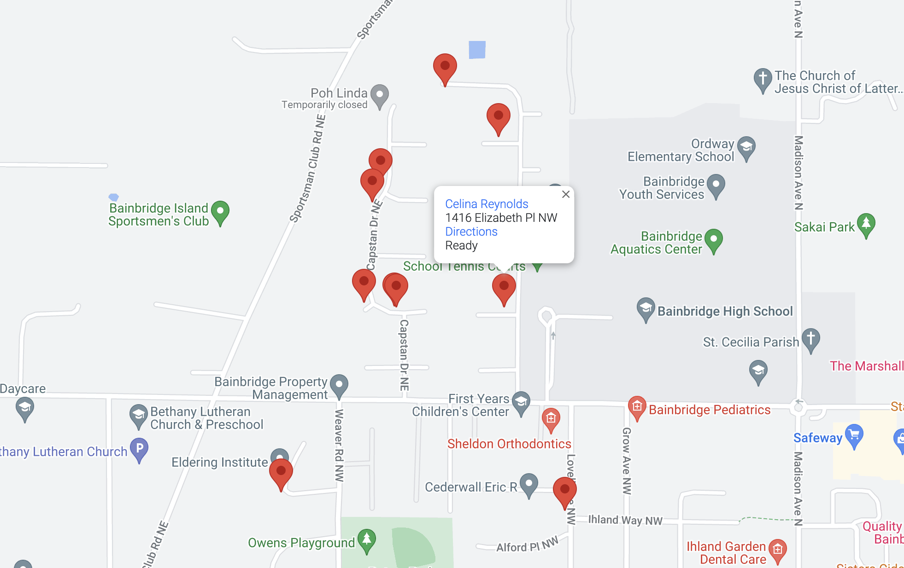

** Documentation is being revamped and is currently far from complete.

# Tree Recycle

Organize a Christmas tree recycling fundraiser seamlessly with Tree Recycle. Streamlining the tree pickup reservation and donation process and the logistics of tree pickup across a broad area, Tree Recycle offers the following features:

- Establish a user-friendly public website for reserving tree pickups.
- Process pickup reservations and geocode addresses for mapping purposes.
- Efficiently categorize addresses into pre-defined Routes, grouped within Zones and assigned to designated drivers.
- Facilitate online donations through a secure platform.
- Retain reservation data from year to year, enabling targeted marketing to previous customers through email reminders for the current year's event.
- Issue SMS and email notifications in cases where drivers cannot locate a tree (a common occurrence when individuals forget to place them out). Deliver email confirmations for reservations, donation receipts, and promotional emails.

Our Troop uses this application and it can be viewed at [https://treerecycle.net](https://treerecycle.net).

If you have any questions concerning this application, feel free to email me at carson.cole@gmail.com.


## REQUIREMENTS

### Heroku

The instructions provide for installation details on [Heroku](https://heroku.com/), a PaaS cloud hosting service. However, it's important to note that there is no direct configuration for Heroku, providing flexibility for installation either in other cloud providers or on a baremetal server.

### Database

A database is required and Heroku provides a number of choices that you can add directly through the web interface. For this application, I recommend the 'Heroku Postgres' addon, and you should add it to your application. You can select the least expensive plan as you have the ability to upsize at a later time. There may be a free plan that provides for up to 10,000 rows, which you can use initially and upgrade as your needs change.

### Redis

A Redis addon must be enabled on Heroku to provide the live functionality such as Admin header new messages counts, and live updating of reservations, in the Admin section. This is required as the appliation will not function without it. Search the addons for 'Heroku Data for Redis' and add it with the least expensive plan.

### Mapping service

A mapping service is required to provide geocoding and geofencing services. Amazon Location Service mapping is configured by default but this can be changed in ``` config/intializers/geocoder.rb```.

For the Amazone Locations Service, you'll need an AWS account. Create a Place Index and give it a name, ie. 'tree_recycle', with the data provider 'Esri' with a single use.  You'll then need API credentials which you can obtain in your main profile under 'Security Credentials'.

Your API credentials should then be configured in your credentials file `config/credentials.yml.enc`.

```ruby
lookups:
  amazon_location_service:
    access_key_id: SOMEKEY
    secret_access_key: aSecretAccessKey
```
### USPS

USPS API access is needed for address verification (https://www.usps.com/business/web-tools-apis/). A required key should be configured in the credentials `config/credentials.yml.enc` file.


### Email

An email provider, such as Gmail, can be configured for reservation notifications, reminders, cancellations, marketing emails, and donation receipts. The default configuration is Gmail, as it is free and normally would provide a high enough daily limit (300-500 emails) to meet the needs of most users.

It is not recommended that you send out marketing emails in large quantities as they could be flagged as spam by both Gmail and the receiving email servers. There is a batch quantity limit setting where you can set the maximum number of emails to send at a time. The exact limits that Gmail applies to outgoing quantity limits are uncertain, but believed to be 20/hour, or 500 over a rolling 24 hour period. Depending on your emailing needs, there are alternate commercial email providers that you can integrate at substantially higher outgoing levels.

Configure each environment with mail settings. Setting and credentials are managed in the Rails credentials file. The sample settings have the correct values if you use Gmail for sending emails. If you use a different service, you may need to modify or add to the settings in the individual environment files.


Mail settings in `production.rb`.

``` ruby
    config.action_mailer.smtp_settings = {
    :address              => Rails.application.credentials.mailer.development.address,
    :port                 => Rails.application.credentials.mailer.development.port,
    :user_name            => Rails.application.credentials.mailer.development.user_name,
    :password             => Rails.application.credentials.mailer.development.password,
    :authentication       => Rails.application.credentials.mailer.development.authentication,
    :tls                  => Rails.application.credentials.mailer.development.tls,
    :enable_starttls_auto => Rails.application.credentials.mailer.development.enable_starttls_auto
```

The mailer itself should be updated to default to the sending address in `application_mailer.rb`.

``` ruby
    class ApplicationMailer < ActionMailer::Base
      default from: "from@example.com"
      layout "mailer"
    end
```

The default URL for mail is set in the environment configuration file `production.rb` or `development.rb`.

```ruby
    config.action_mailer.default_url_options = { host: 'site@example.com' }
```

### SMS notifications

An SMS service is needed if you want to be able to send SMS notifications. This is particularly useful when a driver can not locate a tree pickup. They can indicate a missing tree in the app and it will immediately send an SMS notification. It is not uncommon for people to forget to put their trees out for pickup. SMS notifications are configured to send via Twilio, but this could be modified for any service in the Sms class `sms.rb`. Keys must be set in the Rails ```config/credentials.yml.enc``` file.

---

## Installation

You will need to install the application locally, before which you can then deploy to your Heroku account.


Install Ruby on Rails 7, Ruby > 3.0.0, and PostgreSQL. Then `bundle install` to install the necessary gems.


To setup the database, which gets its configuration from `db/database.yml`:

```ruby
    rails db:create
```
For development use, there is seed data that can be loaded if you want to see the site configured with zones, routes, and reservations and other data by

```ruby
    rails db:seed
```

In production, Heroku will configure settings when you initially deploy.


Edit the config file `config/initializers/constants.rb`, accordingly.


When taking reservations, users select from a drop down where they heard about the event. The choices are hard-coded as an Enum in `reservation.rb` and should be configured to fit your own community.

    enum :heard_about_source, { facebook: 1, safeway_flyer: 6, christmas_tree_lot_flyer: 7, nextdoor: 2, newspaper: 8, roadside_sign: 3, 'Town & Country reader board': 9, word_of_mouth: 4, email_reminder_from_us: 5, other: 99 }

To start up the application:

``` ruby
    % bundle install
    % rails s
```

Configure admin users for management access. The initial adminstrator/owner user should be created directly in the console.

```ruby
    %  User.create(email: 'admin email', password: 'admin password', role: 'administrator')
```

Once the initial user is setup, you can manage the user roles (`viewer`, `editor`, `administrator`) through the UI, after any user signs up at `/sign_up`. The ability to sign up is configured in `initializers/clearance.rb`

```ruby
    config.allow_sign_up = true
```

The application does a lot of background work in the handling of emails and routing, such as sending a confirmation email when a reservation is made, or cancellation email, if cancelled, so you will need a Worker enabled. The worker will look for jobs that are stored in your database in the `delayed_jobs` table.

On Heroku, once your code has been deployed, there will a Worker listed under Resources, which you will need to enable. Until you enable it, no emails will be sent from your application.


#### Setup


To start up the application:

```ruby
    % bundle install
    % rails s
```

### Driver

The driver component of the app is at `/driver`. By default, resources under this namespace are open publicly by default, with the risks being that reservation personal information as well as the ability to toggle the status of the pickup. It is suggested that once your app is live, that you enable authenticated accessed by configuring a `Driver secret key` in admin `Settings`. Then access to these resources require the initial request to have the key, but subsequent requests do not, unless the key is reset in the settings.

With a driver secret key of `happy`: `/driver/key=happy`. So the URL for accessing the driver part of the app:

    https://example.com/driver?key=happy


### Marketing emails


You can send marketing emails through the Settings section, where two email templates (Marketing Email #1, Marketing Email #2), one followed by the other, are available. You can modify `/views/marketing_mailer/marketing_email_1.html.haml` and `/views/marketing_mailer/marketing_email_2.html.haml`, and their `.text.haml` versions.

The batch email size determines the number of emails sent at once. It's crucial to set this number within your mail provider's daily sending limit; for example, Gmail has an estimated limit of 500 emails per day. When you send a batch, the system will send the next set of emails that haven't been sent yet, ensuring no duplicates. This information is visible in the reservation and reservation log once marketing emails have been sent.


## Mapping

Reservations are mapped into admin-defined routes. When entered, reservations will be checked for existence within Routes by either 1) a Route that is nearest to it (each Route has a base address), or 2) with a Route that has polygon defined for it. Multi-point polygons can be entered for each route.

### Routes

Routes need to be defined by first, a base address, and optionally, a polygon made up of 3 or more coordinates (entered counter-clockwise). Polygons can be defined to contain specific roads and addresses, and generally polygons should abut, not overlay, other Route polygons.

Routes should essentially be an area that could contain a manageable group of tree pickups. A pickup driver could be assigned to one or more Routes.

Maps of all pickups within a route are available in `Routes` in the adminstration section of the application. Clicking on each pickup on the map will show if its been picked up and has a link to directions to the pick-up.



### Zones

Zones are made up of Routes and are used for organizational purposes so that Zone leaders can be defined to oversee groups of Routes.


## Secret credentials

The app maintains application secrets in a credential file within the codebase at `/credentials.yml.enc`. The secrets include passwords and keys to access email providers, Twilio and more. You will add your own secrets to this file, which will be encrypted, and then deployed within your codebase to be used in Production on Heroku.

Delete any existing `config/credentials.yml.enc` file. Initialize your own secrets file:

```ruby
    % EDITOR=vim rails credentials:edit
```

This will create your initial credentials file and open it in an editor. Copy the contents of `/config/credentials_sample.yml` as your initial template and edit it accordingly.

Exit the credentials file with `esc-:-q`. This will save the file and the key for decrypting it into `config/master.key`. Copy this key and add it to your Heroku Vars (see App Credentials below), under your application settings, with a key value of `RAILS_MASTER_KEY`. This key is what Heroku will use to access the credentials file.

On Heroku, you need to provide the master key so the file can be decrypted. You can do this through the Heroku UI, or in the Heroku console:


```ruby
    heroku config:set RAILS_MASTER_KEY=<your-master-key>
```

## Error monitoring (optional)

Rollbar.io is integrated for error monitoring, This can be easily replaced with other services. The configuration file is `config/initializers/rollbar.rb` and the access token is stored in the Rails credentials file, which is the only thing that needs to be updated for it to work within your own Rollbar account. Rollbar is free for 5,000 errors a month, which should easily cover it.

To remove Rollbar completely, removed from the ```Gemfile``` and ```initializers/rollbar.rb```.


## Installation on Heroku

### 1. Create Heroku.com account and application

Create a Heroku account, and then create a new application through the web interface.  Instructions for doing this on Heroku is well documented on Heroku.com.

### 3. Add Redis

A Redis addon must be enabled on Heroku to provide the live functionality such as Admin header new messages counts, and live updating of reservations, in the Admin section. This is required as the appliation will not function without it. Search the addons for 'Heroku Data for Redis' and add it with the least expensive plan.

### 4. Download the repo locally, deploy to Heroku

The application needs to be downloaded locally, with modifications made concerning your own deployment, then deployed to Heroku. 

Download this repo from Github. Instructions on doing this are widely available.


### 5. Deploy to Heroku.com

Instructions can be found on [Heroku.com](https://devcenter.heroku.com/articles/git)

### 6. Add a Worker

The application does a lot of background work in the handling of emails and routing, such as sending a confirmation email when a reservation is made, or cancellation email, if cancelled, so you will need a Worker enabled. The worker will look for jobs that are stored in your database in the `delayed_jobs` table. 

Once your code has been deployed, there will a Worker listed under Resources, which you will need to enable. Until you enable it, no emails will be sent from your application.

#### Configuration

Once your application has been deployed to Heroku, you should be able to access to public portal, but you will need a login to access the Admin portal. You will need to create an admin user through the console that can be access via your local installation of the applicdation:

```ruby
    % heroku console
    % User.create(email: 'john.doe@example.com', password: [password])
```

---

## Testing

There are Rails minitest tests, including system tests.

For mailers, previews exist for the confirmation and reminder emails. To view in `development`:

```ruby
    http://localhost:3000/rails/mailers/
```

## Seed Data

Trial seed data can be loaded. This will create the initial admin user (admin@example.com, password: password), route, zone and reservation data. Use this data to only preview the apps functionality, not for production purposes.

```ruby
    rails db:seed
```

---

## Copyright

Copyright (c) 2022, 2023 [Carson Cole](https://carsonrcole.com). It is free software, and may be redistributed under the terms specified in the LICENSE file.
